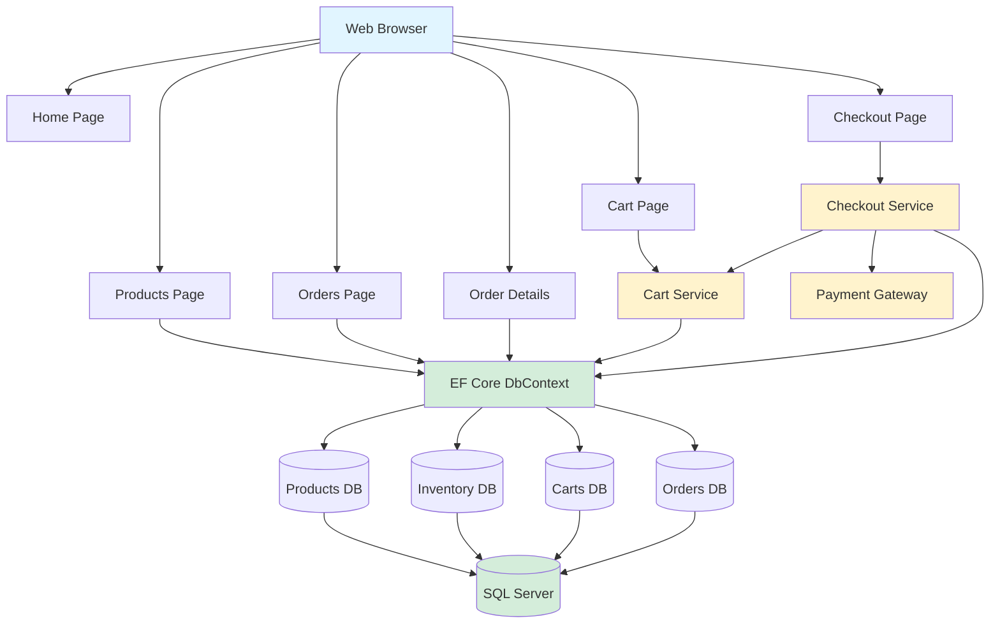
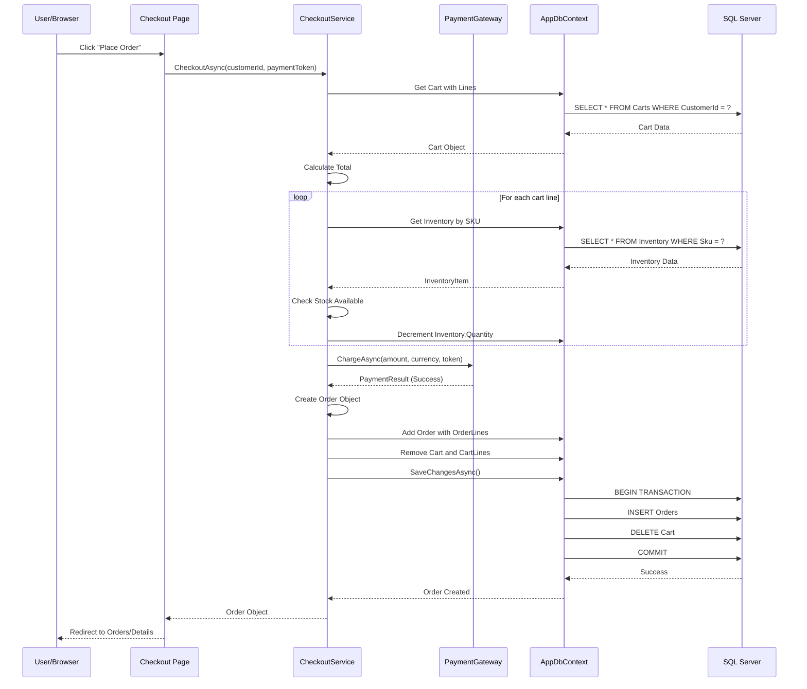

# Retail Monolith Architecture

## Component Descriptions

### **Presentation Layer (Razor Pages)**
- **Pages**: Server-rendered HTML views with C# code-behind
- Handles user interactions and displays data
- Routes: `/`, `/Products`, `/Cart`, `/Checkout`, `/Orders`

### **Application Layer (Services)**
- **CartService**: Add/remove items, update quantities, clear cart
- **CheckoutService**: Orchestrates checkout workflow
  1. Retrieves cart
  2. Reserves inventory
  3. Processes payment
  4. Creates order
  5. Clears cart
- **MockPaymentGateway**: Simulates payment processing (always succeeds)

### **Data Layer**
- **AppDbContext**: EF Core context managing all database operations
- **Models**: Product, Cart, CartLine, Order, OrderLine, InventoryItem
- **Migrations**: Database schema versioning

### **Infrastructure**
- **SQL Server LocalDB**: Development database (swap to Azure SQL for production)
- **Health Checks**: `/health` endpoint for monitoring
- **Minimal APIs**: REST endpoints for headless checkout scenarios

## Data Flow: Complete Checkout Example

## Key Monolith Characteristics

1. **Single Deployment Unit**: One application, one codebase
2. **Shared Database**: All features access the same SQL Server database
3. **In-Process Communication**: Services call each other via dependency injection
4. **Transactional Consistency**: Database transactions span multiple tables
5. **Tight Coupling**: Checkout depends on Cart, Payment, Inventory, and Orders

## Technology Stack

- **Framework**: ASP.NET Core 9.0
- **UI**: Razor Pages (server-side rendering)
- **ORM**: Entity Framework Core 9.0
- **Database**: SQL Server / LocalDB
- **DI Container**: Built-in ASP.NET Core DI
- **Frontend**: Bootstrap 5, jQuery (from CDN)

---

*This diagram represents the current monolithic architecture. The app is designed to demonstrate migration patterns toward microservices decomposition.*
